# SureFeedback Client Site Plugin - Comprehensive Repository Analysis

## Table of Contents
1. [Executive Summary](#executive-summary)
2. [Software Architecture Analysis](#software-architecture-analysis)
3. [Technical Deep Dive](#technical-deep-dive)
4. [Product Management Insights](#product-management-insights)
5. [Security Analysis](#security-analysis)
6. [Development Workflow & CI/CD](#development-workflow--cicd)
7. [Recommendations](#recommendations)

---

## Executive Summary

The **SureFeedback Client Site** plugin is a sophisticated WordPress plugin designed to create a secure bridge between client websites and a centralized SureFeedback parent dashboard. This plugin enables real-time feedback collection through a sticky note-style interface, allowing clients to provide targeted feedback on specific areas of web designs and projects.

### Key Business Value Propositions
- **Centralized Feedback Management**: Single dashboard to manage feedback from multiple client sites
- **Streamlined Client Experience**: No registration required for clients already logged into their sites
- **White Label Support**: Full customization for agencies to brand the plugin as their own
- **Multi-site Architecture**: Scalable solution for agencies managing multiple client projects

### Technical Highlights
- WordPress plugin architecture with secure REST API integration
- Cross-origin resource sharing (CORS) implementation for secure communication
- Role-based access control with granular permissions
- Token-based authentication system with HMAC signatures
- Compatibility with major page builders (Elementor, Divi, Beaver Builder, etc.)

---

## Software Architecture Analysis

### System Architecture Overview

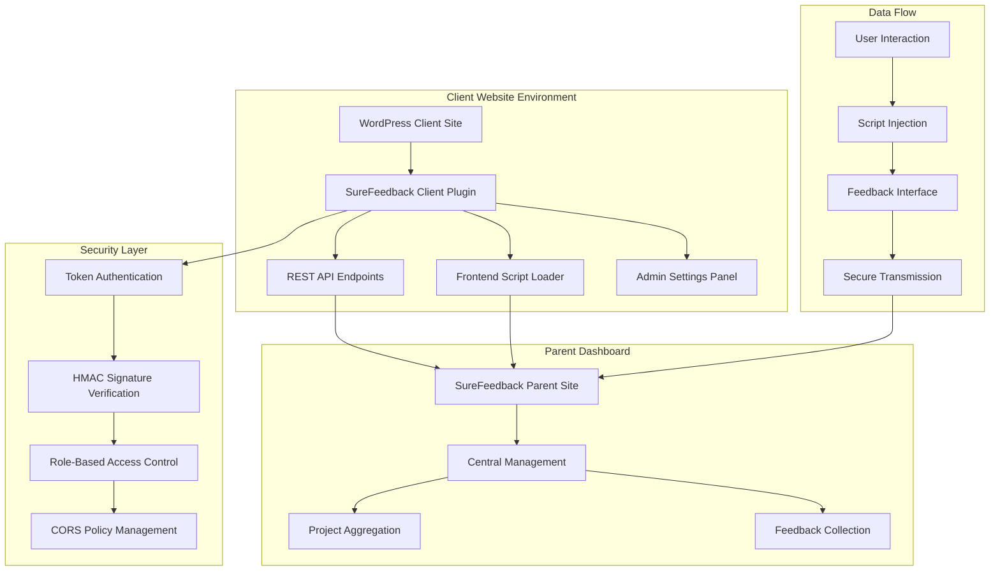

### Core Components Architecture

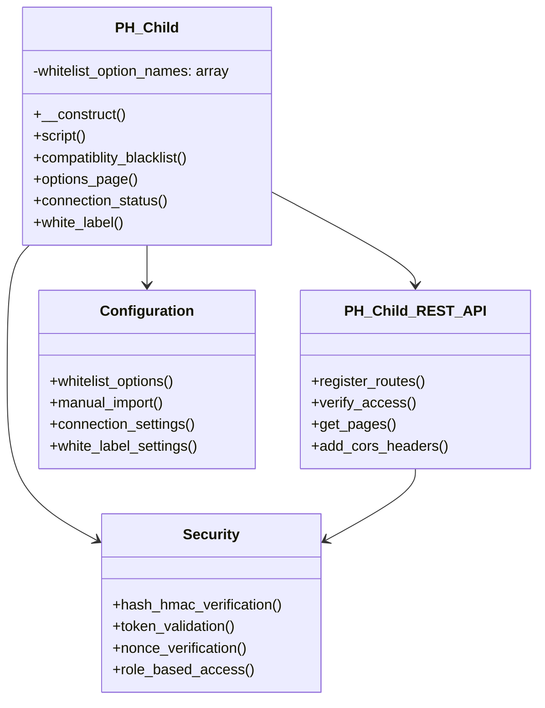

### Data Flow Architecture

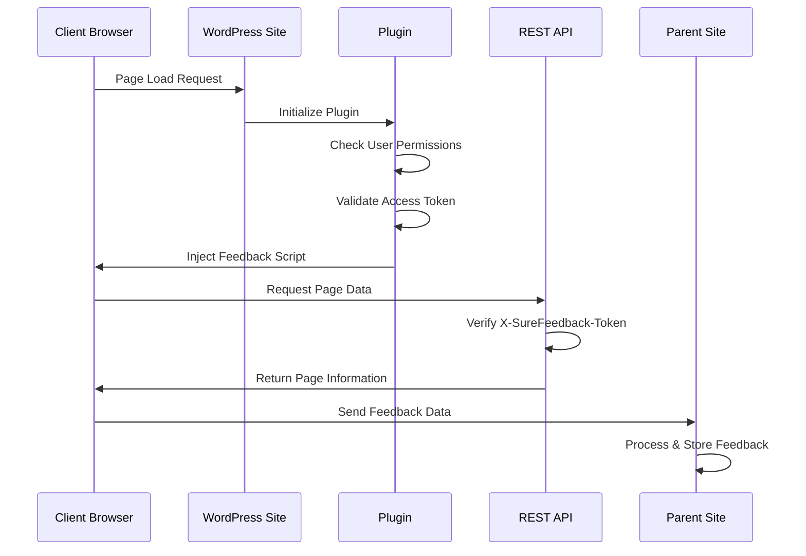

---

## Technical Deep Dive

### Plugin Structure & File Organization

```
projecthuddle-child-site/
├── Core Files
│   ├── ph-child.php                    # Main plugin file & class
│   ├── ph-child-functions.php          # Utility functions
│   ├── ph-child-rest-api.php          # REST API implementation
│   └── uninstall.php                   # Clean uninstall process
├── Configuration
│   ├── composer.json                   # PHP dependencies
│   ├── package.json                    # Node.js dependencies
│   ├── phpstan.neon                    # Static analysis config
│   ├── phpstan-baseline.neon           # Known issues baseline
│   └── phpcs.xml.dist                  # Code standards config
├── Build & Deploy
│   ├── GruntFile.js                    # Build automation
│   ├── sync.sh                         # WordPress.org deployment
│   └── .github/workflows/              # CI/CD pipelines
├── Assets & Documentation
│   ├── readme.txt                      # WordPress.org readme
│   ├── LICENSE                         # GPL v2+ license
│   └── .wordpress-org/                 # Plugin assets
└── Testing
    └── tests/php/stubs/                # PHPStan stubs
```

### Security Implementation Deep Dive

#### Authentication & Authorization Matrix

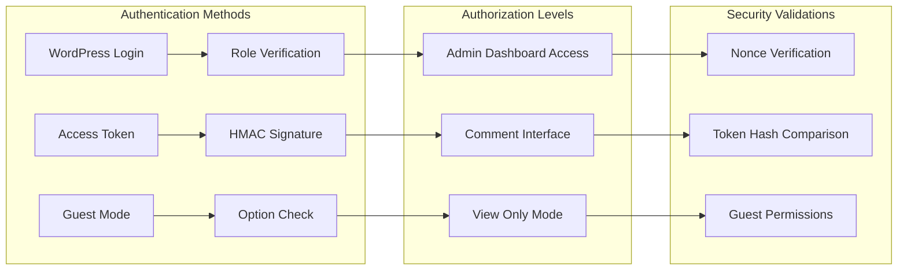

#### Token-Based Security System

The plugin implements a sophisticated multi-layer security system:

1. **Access Token Validation**
   ```php
   public function verify_access($request) {
       $token = $request->get_header('X-SureFeedback-Token');
       $valid_token = get_option('ph_child_access_token', '');
       
       if (!hash_equals($valid_token, $token)) {
           return new WP_Error('rest_forbidden', 'Invalid access token');
       }
   }
   ```

2. **HMAC Signature Generation**
   ```php
   $args['ph_signature'] = hash_hmac(
       'sha256', 
       sanitize_email($user->user_email), 
       get_option('ph_child_signature', false)
   );
   ```

3. **Role-Based Access Control**
   - Granular role selection for comment visibility
   - Guest user support with explicit permission
   - Admin dashboard commenting toggle

### REST API Implementation

#### Endpoint Architecture

```mermaid
graph TB
    subgraph "REST API Structure"
        A[/surefeedback/v1/] --> B[/pages]
        B --> C[GET: List Pages]
        B --> D[OPTIONS: CORS Preflight]
    end
    
    subgraph "Security Headers"
        E[X-SureFeedback-Token] --> F[Token Validation]
        F --> G[Access Control]
    end
    
    subgraph "CORS Implementation"
        H[Origin Verification] --> I[Header Management]
        I --> J[Credential Support]
    end
    
    C --> E
    D --> H
```

#### CORS Security Implementation

The plugin implements selective CORS policies that only apply to SureFeedback endpoints:

```php
public function add_cors_headers() {
    add_filter('rest_pre_serve_request', function($served, $result, $request, $server) {
        $route = $request->get_route();
        if (strpos($route, '/surefeedback/') !== 0) return $served;
        
        header('Access-Control-Allow-Origin: ' . $origin);
        header('Access-Control-Allow-Credentials: true');
        header('Access-Control-Allow-Methods: GET, POST, OPTIONS, PUT, DELETE');
        header('Access-Control-Allow-Headers: Content-Type, X-SureFeedback-Token, Authorization, X-WP-Nonce');
    }, 10, 4);
}
```

### Page Builder Compatibility System

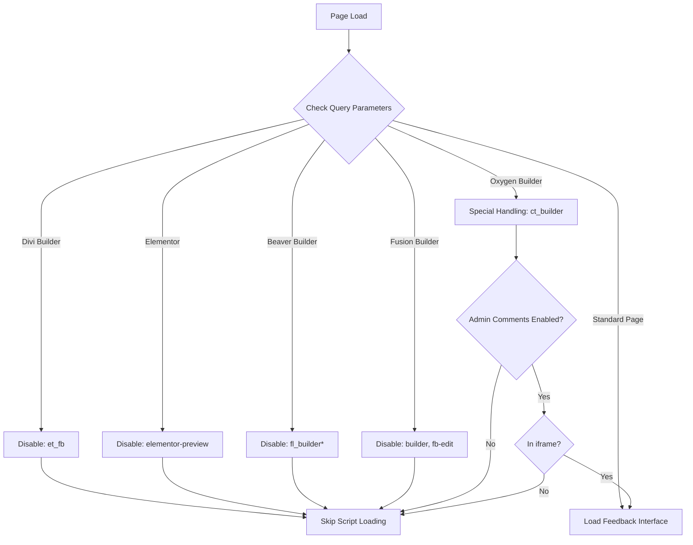

---

## Product Management Insights

### User Journey & Experience Flow

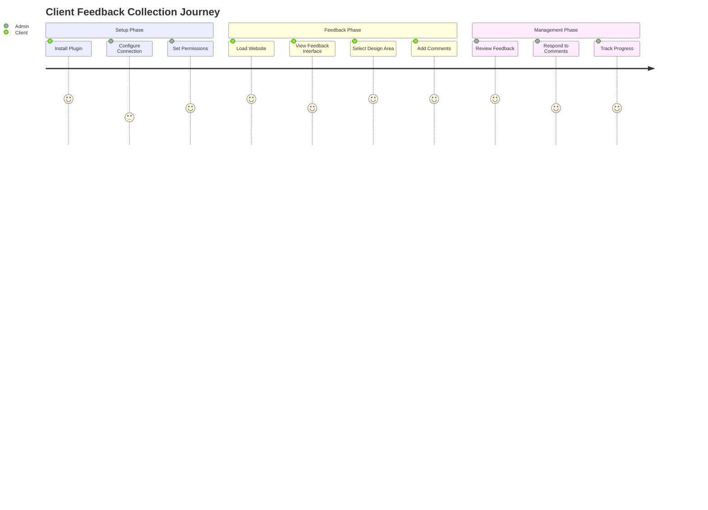

### Feature Matrix & Capabilities

| Feature | Client Site | Parent Dashboard | Technical Implementation |
|---------|-------------|------------------|-------------------------|
| **Feedback Collection** | ✅ Sticky note interface | ✅ Aggregated view | JavaScript injection |
| **User Authentication** | ✅ WordPress login sync | ✅ Identity management | HMAC signatures |
| **Role Management** | ✅ Granular permissions | ✅ Cross-site roles | WordPress roles API |
| **Guest Access** | ✅ Optional guest comments | ✅ Guest identity tracking | Cookie-based tokens |
| **White Labeling** | ✅ Full customization | ✅ Agency branding | WordPress filters |
| **Multi-site Support** | ✅ Individual configuration | ✅ Centralized management | REST API communication |

### Competitive Advantages

1. **Seamless Integration**: No separate registration flow required for existing WordPress users
2. **Agency-Focused**: Built-in white labeling and multi-client management
3. **Developer-Friendly**: Extensive compatibility with popular page builders
4. **Security-First**: Multiple authentication layers and secure token system
5. **Scalable Architecture**: Designed for agencies managing dozens of client sites

### Product Roadmap Insights

Based on the codebase analysis, potential future developments could include:

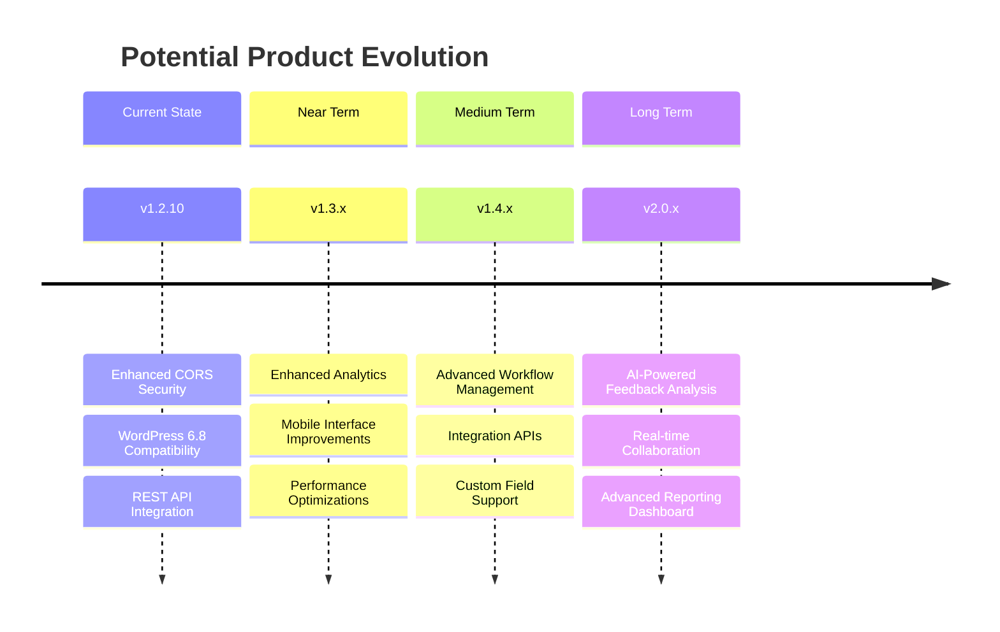

---

## Security Analysis

### Security Model Architecture

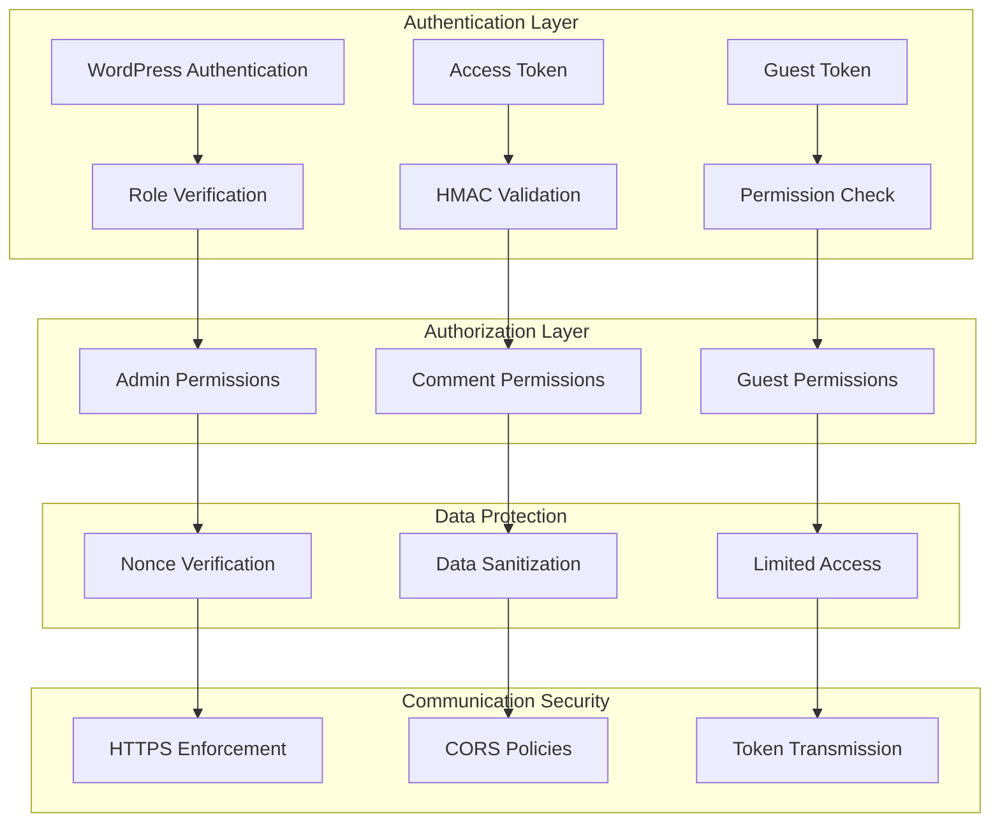

### Security Vulnerabilities Analysis

#### Strengths
1. **Hash-based Token Comparison**: Uses `hash_equals()` to prevent timing attacks
2. **Nonce Verification**: Proper WordPress nonce implementation for state-changing operations
3. **Data Sanitization**: Comprehensive input sanitization using WordPress functions
4. **Role-based Access**: Granular permission system based on WordPress roles
5. **CORS Implementation**: Selective CORS policies only for plugin endpoints

#### Potential Security Considerations
1. **Token Storage**: Access tokens stored in localStorage could be vulnerable to XSS
2. **Cross-site Communication**: Parent site URL validation could be strengthened
3. **Error Information**: Some error messages might reveal system information

### Security Compliance Matrix

| Security Aspect | Implementation | Grade | Notes |
|------------------|----------------|-------|-------|
| **Authentication** | Multi-factor (WordPress + Token) | A | Strong implementation |
| **Authorization** | Role-based + Custom permissions | A | Granular control |
| **Data Validation** | WordPress sanitization functions | A | Industry standard |
| **CSRF Protection** | WordPress nonces | A | Proper implementation |
| **XSS Prevention** | Output escaping | A | Consistent usage |
| **SQL Injection** | WordPress prepared statements | A | Uses WP functions |
| **Communication** | HTTPS + CORS | B+ | Could enhance token handling |

---

## Development Workflow & CI/CD

### Development Stack Analysis

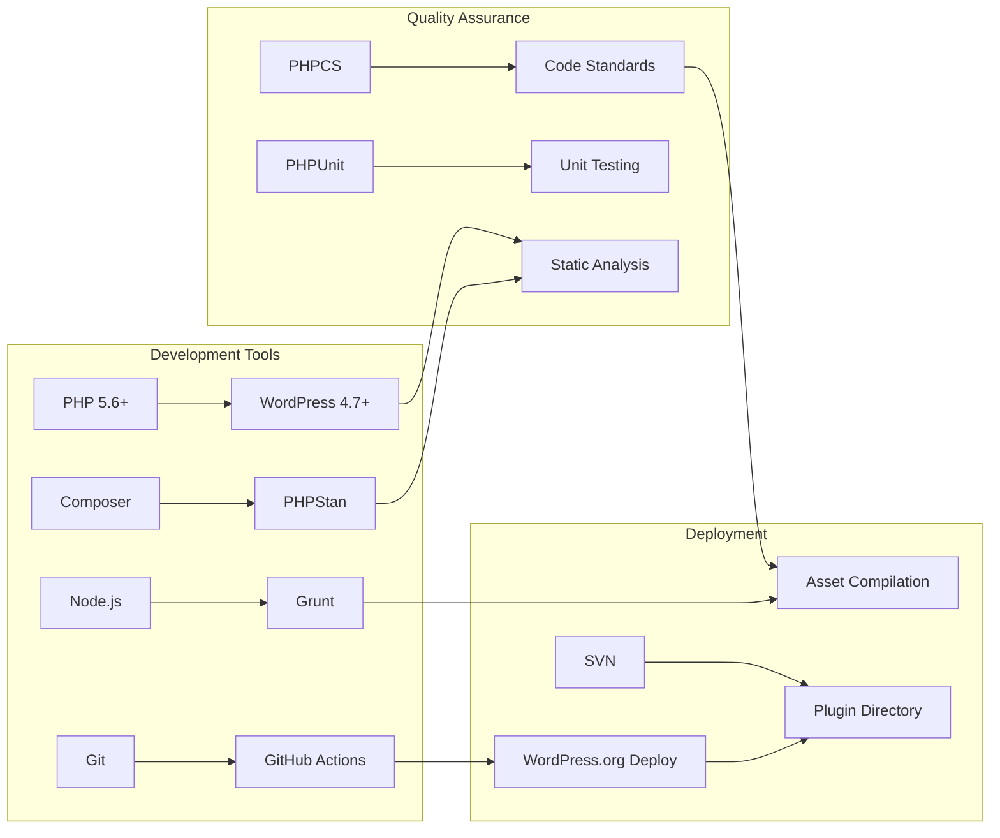

### CI/CD Pipeline Architecture

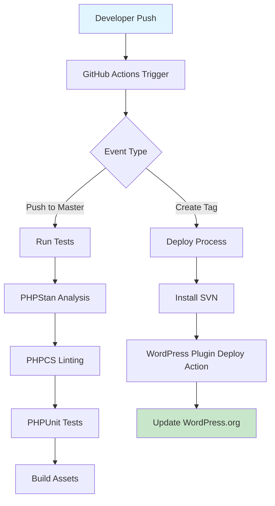

### Code Quality Standards

The project maintains high code quality through:

1. **Static Analysis** (PHPStan Level 9)
   - Strict type checking
   - WordPress-specific rules
   - Baseline management for legacy issues

2. **Code Standards** (WordPress Coding Standards)
   - PSR-12 compatible
   - WordPress-specific conventions
   - Automated formatting with PHPCBF

3. **Testing Strategy**
   - Unit tests with PHPUnit
   - Integration testing
   - Stub generation for external dependencies

### Build Process

```bash
# Development Commands
composer install          # Install dependencies
npm install               # Install Node dependencies
grunt i18n               # Generate translation files
grunt readme             # Generate README.md
grunt release            # Create distribution package

# Quality Assurance
composer lint            # Run PHPCS linting
composer format          # Auto-fix code style
composer phpstan         # Run static analysis

# Deployment
npm run release          # Deploy to WordPress.org
```

---

## Recommendations

### Immediate Improvements (1-2 months)

#### Security Enhancements
1. **Enhanced Token Security**
   ```php
   // Implement token rotation
   public function rotate_access_token() {
       $new_token = wp_generate_password(32, false);
       update_option('ph_child_access_token', $new_token);
       return $new_token;
   }
   ```

2. **Rate Limiting Implementation**
   ```php
   // Add rate limiting to REST endpoints
   public function check_rate_limit($request) {
       $ip = $_SERVER['REMOTE_ADDR'];
       $attempts = get_transient("ph_attempts_$ip");
       if ($attempts >= 10) {
           return new WP_Error('rate_limit', 'Too many requests');
       }
   }
   ```

#### Performance Optimizations
1. **Script Loading Optimization**
   - Implement conditional loading based on page type
   - Add script minification and caching
   - Optimize for Core Web Vitals

2. **Database Query Optimization**
   - Add caching for frequently accessed options
   - Implement transients for expensive operations

### Medium-term Enhancements (3-6 months)

#### Feature Additions
1. **Advanced Analytics Integration**
   ```mermaid
   graph LR
       A[Feedback Events] --> B[Analytics Tracking]
       B --> C[Performance Metrics]
       C --> D[Client Dashboard]
   ```

2. **Webhook System**
   ```php
   // Add webhook notifications
   public function trigger_webhook($event, $data) {
       $webhook_url = get_option('ph_child_webhook_url');
       if ($webhook_url) {
           wp_remote_post($webhook_url, [
               'body' => json_encode(['event' => $event, 'data' => $data])
           ]);
       }
   }
   ```

#### Architecture Improvements
1. **Microservice Architecture Transition**
   - Separate API service
   - Dedicated authentication service
   - Improved scalability

2. **Modern JavaScript Framework Integration**
   - React/Vue.js frontend
   - Real-time updates with WebSockets
   - Progressive Web App features

### Long-term Strategic Vision (6+ months)

#### Platform Evolution
1. **Multi-platform Support**
   - Shopify integration
   - Custom CMS adapters
   - Headless CMS compatibility

2. **AI/ML Integration**
   - Automated feedback categorization
   - Sentiment analysis
   - Smart notification routing

3. **Enterprise Features**
   - SSO integration
   - Advanced role management
   - Compliance reporting

### Technical Debt Priorities

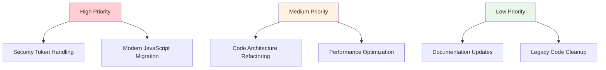

---

## Conclusion

The SureFeedback Client Site plugin represents a well-architected, security-conscious WordPress plugin that successfully bridges the gap between client websites and centralized feedback management. The codebase demonstrates:

- **Strong Security Practices**: Multi-layered authentication and authorization
- **WordPress Best Practices**: Proper use of WordPress APIs and conventions
- **Scalable Architecture**: Designed for multi-site, agency-focused deployments
- **Quality Engineering**: Comprehensive testing and CI/CD processes

The plugin is well-positioned for continued growth and could benefit from modern frontend technologies, enhanced security measures, and expanded integration capabilities. The technical foundation is solid, making it an excellent candidate for both immediate improvements and long-term strategic enhancements.

---

*This analysis was generated on August 9, 2025, based on SureFeedback Client Site Plugin version 1.2.10*
